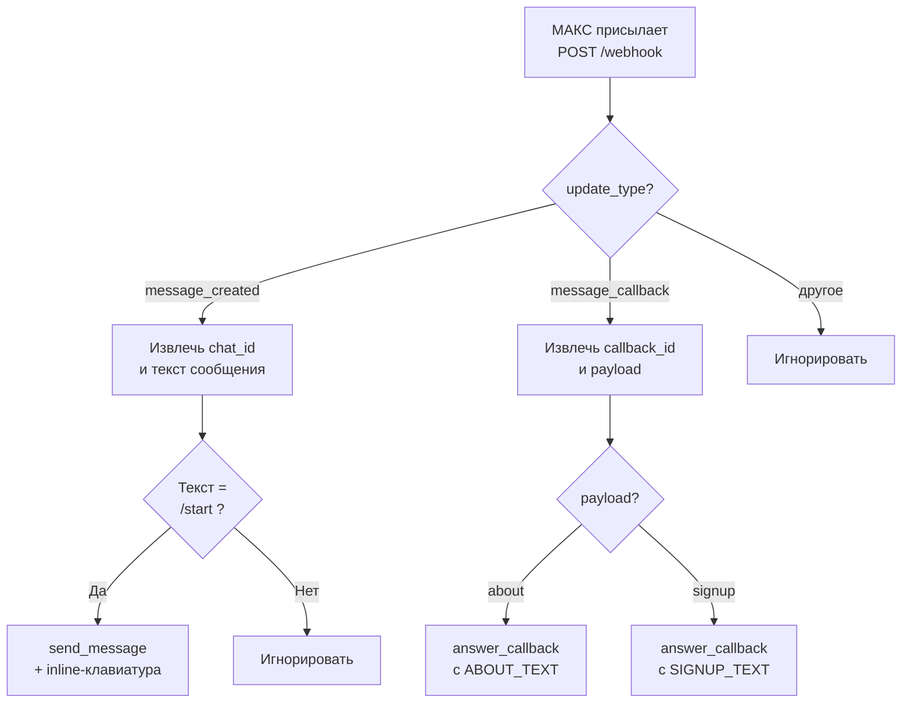

# Архитектура

Бот построен на FastAPI и работает как тонкая прокладка между мессенджером МАКС и пользователем. Внутреннего состояния нет: каждое обращение обрабатывается независимо, что упрощает горизонтальное масштабирование и деплой в любую среду с публичным HTTPS.

## Компоненты

| Компонент           | Назначение                                                   |
|---------------------|--------------------------------------------------------------|
| `FastAPI`           | HTTP-сервер, принимающий вебхуки от МАКС                     |
| `requests`          | Клиент для исходящих вызовов к MAX Platform API              |
| `logging`           | Журналирование входящих и исходящих сообщений                |
| Переменная `MAX_TOKEN` | Токен бота, который кладётся в заголовок `Authorization` |

## Эндпоинты

| Метод   | Путь        | Назначение                                |
|---------|-------------|-------------------------------------------|
| `GET`   | `/`         | Корневой пинг, возвращает `{"status":"ok"}` |
| `GET`   | `/health`   | Проверка живости для платформ деплоя       |
| `POST`  | `/webhook`  | Приём обновлений от МАКС                   |

## Поток обработки

## Сценарий «новый пользователь»

1. Пользователь открывает чат с ботом в МАКС и отправляет `/start`.
2. МАКС формирует обновление с `update_type = "message_created"` и шлёт его на `POST /webhook`.
3. Бот достаёт `chat_id` из `message.recipient.chat_id` и текст из `message.body.text`.
4. Если текст равен `/start` или `/старт`, бот отправляет приветственное сообщение с инлайн-клавиатурой методом `POST /messages?chat_id={chat_id}`.
5. Клавиатура содержит две кнопки с `payload`-значениями `about` и `signup`.

## Сценарий «нажатие кнопки»

1. Пользователь нажимает кнопку.
2. МАКС присылает обновление с `update_type = "message_callback"`, в котором есть `callback.callback_id` и `callback.payload`.
3. Бот вызывает `POST /answers?callback_id={callback_id}` с текстом, соответствующим выбранному payload.

## Решения и почему так

**Нет БД и FSM.** Бот не хранит состояние между запросами — все возможные ветки исчерпываются командой `/start` и двумя callback-ами. Городить FSM ради этого было бы избыточно, а stateless-режим даёт лёгкий горизонтальный масштаб и простое восстановление после рестарта.

**Жёсткие тексты в коде.** Тексты `START_TEXT`, `ABOUT_TEXT`, `SIGNUP_TEXT` зафиксированы в исходниках. Это сознательный компромисс: для одного бота с короткими текстами выносить их в БД или CMS дороже, чем редактировать в репозитории и деплоить заново. Если когда-то понадобится менять тексты без релиза, логичный следующий шаг — переезд в JSON-файл рядом с кодом или в Google Sheets.

**Синхронный `requests` вместо `httpx`.** FastAPI спокойно работает с синхронными вызовами в обработчиках; для такой нагрузки разница незаметна. Если поток событий вырастет, переход на `httpx.AsyncClient` сделает обработку нелинейно дешевле.

**Один общий `post_max`.** Все исходящие запросы идут через единую функцию: общий заголовок `Authorization`, таймаут, единое логирование, единая обработка `RequestException`. При появлении новых методов (отправка медиа, изменение клавиатуры) добавлять обвязку не придётся.

## Что осознанно не сделано

- Нет проверки подписи входящих вебхуков. В личном кабинете МАКС такой механизм не настроен.
- Нет ретраев исходящих запросов. При ошибке платформы пользователь не получит ответ; это допустимо, потому что повторное `/start` чинит проблему.
- Нет метрик и трейсинга. Для текущего объёма достаточно логов `stdout`.

Все эти пункты — кандидаты в [CHANGELOG](changelog.md) на будущее.
