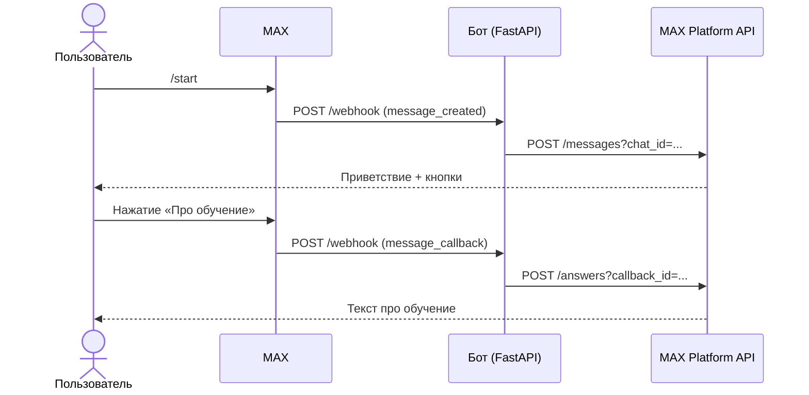

# MAX Bot

Чат-бот для мессенджера **МАКС**, который встречает нового пользователя приветственным сообщением, направляет его в мини-приложение **Gemini** и рассказывает об условиях участия в платном интенсиве по нейросетям.

Бот работает в режиме вебхуков: МАКС присылает обновления на эндпоинт `/webhook`, бот отвечает через REST API.

!!! info "Версия"
    Документация соответствует версии бота **1.0.0**. Журнал изменений — на странице [CHANGELOG](changelog.md).

## Что умеет бот

- Отвечает на команду `/start` приветственным сообщением с инлайн-клавиатурой.
- Показывает две кнопки: **«Про обучение»** и **«Записаться»**.
- При нажатии на кнопку отправляет соответствующий ответ через механизм `callback`.
- Логирует входящие обновления и ответы платформы для отладки.

## Архитектура бота



Подробнее — в разделе [Архитектура](architecture.md).

## Быстрый старт

### 1. Клонирование и установка

```bash
git clone https://github.com/golikov-denis/max-bot-gemini.git
cd max-bot-gemini

python -m venv .venv
source .venv/bin/activate      # Windows: .venv\Scripts\activate
pip install -r requirements.txt
```

### 2. Токен бота

Получите токен в личном кабинете разработчика МАКС и положите в переменную окружения:

=== "Linux / macOS"
    ```bash
    export MAX_TOKEN="your-token-here"
    ```

=== "Windows (PowerShell)"
    ```powershell
    $env:MAX_TOKEN = "your-token-here"
    ```

=== "Файл .env"
    ```bash
    cp .env.example .env
    # затем отредактируйте .env
    ```

### 3. Запуск

```bash
uvicorn main:app --host 0.0.0.0 --port 8000
```

Проверка:

```bash
curl http://localhost:8000/health
# {"ok":true}
```

### 4. Публичный URL для вебхука

Платформа МАКС должна иметь возможность достучаться до вашего эндпоинта `POST /webhook`. Для локальной разработки удобнее всего поднять туннель:

```bash
ngrok http 8000
```

Скопируйте HTTPS-адрес из вывода ngrok и зарегистрируйте его в настройках бота как webhook URL.

### 5. Регистрация вебхука

Зайдите в личный кабинет МАКС или используйте API платформы, чтобы привязать публичный URL к вашему боту. После этого отправьте боту в МАКС команду `/start` — должно прийти приветствие с двумя кнопками.

!!! tip "Что дальше"
    Если бот работает локально и отвечает на `/start`, дальше можно идти в раздел [Деплой](deployment/railway.md) и переносить его в облако.

## Структура репозитория

```text
max-bot-gemini/
├── .github/workflows/docs.yml   # CI: сборка и деплой сайта
├── docs/                        # Исходники документации
├── main.py                      # Код бота
├── mkdocs.yml                   # Конфиг MkDocs Material
├── requirements.txt             # Зависимости бота
├── requirements-docs.txt        # Зависимости сборки документации
└── .env.example                 # Шаблон переменных окружения
```
